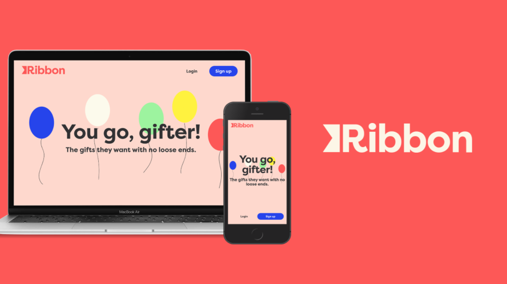

# Ribbon
***Ribbon is the app that makes gift-giving (and gift-receiving) a breeze!***

It's also my capstone project for BrainStation's full-stack bootcamp. We were tasked to ideate, plan, and execute a full-stack application within two weeks. Ribbon was made using create-react-app, react-router, and SASS for the front end, a Node/Express backend API with JWT for auth, and Knex to query a MySQL database. At least for now. We'll see how things change as I continue to build on it.  

[Click here](https://www.loom.com/share/48f77f9c4fe04ecdb802369e78535f72) to watch my demo presentation. 

Thanks for stopping by. 💫

—Jason (2021-04-09)



# Installation

Follow these steps to run a local instance of Ribbon:  
(You'll need node, npm, and MySQL already installed.)

1. Clone or download this repo.
#### Set up the backend
2. Create a new database in MySQL called `ribbon`.
3. Install server dependencies:  
   
   Run `npm install` from inside the server directory.
   ```bash    
   $ cd server
   $ npm install
   ```
4. Run migrations
   ```bash
   $ npm run migrate
   ```
5. Run seeds
   ```bash
   $ npm run seed
   ```
6. Set environment variables:  
   
   Rename `.env_sample` to `.env` and change placeholder values with your own.
   ```shell
   PORT=<PORT_NUMER>
   JWT_SECRET=<SECRET KEY>
   DB_HOST=<HOST ADDRESS>
   DB_USER=<YOUR DB USERNAME>
   DB_PSWD=<YOUR DB PASSWORD>
   ```
7. Start the server:
   ```bash
   $ node index.js
   ```
#### Set up the frontend
8. Install client dependencies:  
   
   Run `npm install` from inside the client directory.
   ```bash    
   $ cd ../client
   $ npm install
   ```
9. Set environment variables:  
   
   Rename `.env_sample` to `.env` and change the placeholder value to the port you set for the server.
   ```shell
   REACT_APP_API_URL=http://localhost:<PORT SET IN /server/.env>
   ```
10. Start the React app:
    ```bash
    $ npm start
    ```
